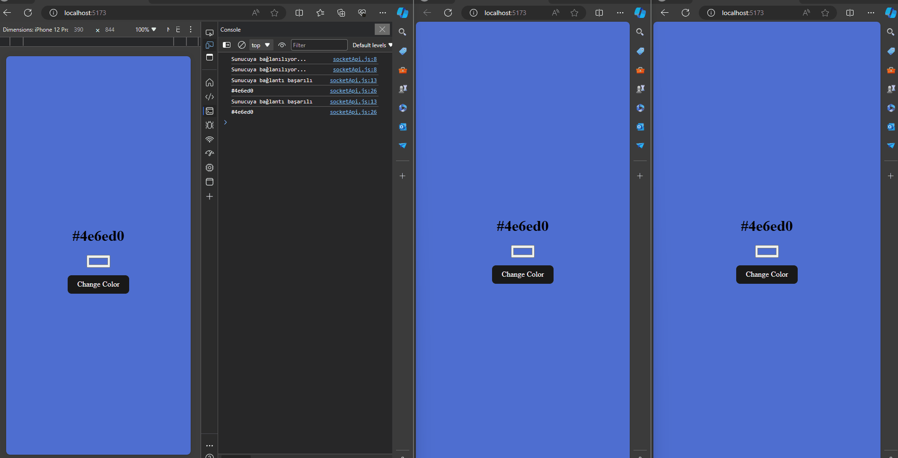

# Real Time React Application

This project contains a real-time React application developed as part of the Patika.dev course. The application operates on a Node.js backend and interactively displays server logs in real-time on the React frontend.

## Example Screenshots




## Features

- **Real-Time Updates**: The application communicates via the WebSocket protocol to receive real-time server logs and displays them in the user interface.
- **User Interactions**: Users can change server-side recorded colors by selecting a color from the color palette.
- **Server Logs**: The server records user connection statuses and color changes, writing them to a log file.

## Technologies Used

- React.js
- Node.js
- WebSocket (Socket.io)
- CSS

## How to Run

1. Clone the project files to your computer.
2. First, start the backend:
    ```bash
    cd backend
    npm install
    npm start
    ```
3. Then, start the frontend:
    ```bash
    cd client
    npm install
    npm run dev
    ```

4. Navigate to `http://localhost:5173` in your browser to view the application.
    Check for port availability and running status for the server !!


## Contributing

If you would like to contribute to the project, please fork it and submit a pull request. We welcome any contributions and suggestions!
